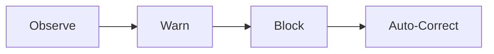

# Enforcement Levels

This document defines **how strongly runtime guardrails act** when a policy or constraint is evaluated.

Enforcement levels allow guardrails to be introduced **progressively**, balancing safety, trust, and developer autonomy.

They answer the question:

> *“What happens when a guardrail is triggered?”*

---

## Why Enforcement Levels Matter

Hard enforcement applied too early creates friction, workarounds, and resistance.

No enforcement at all creates blind spots and unmanaged risk.

Enforcement levels provide a **controlled gradient** between those extremes.

They allow organizations to:
- Learn before blocking
- Build trust before automating correction
- Match enforcement strength to maturity and confidence

---

## The Four Enforcement Levels

Runtime guardrails typically operate at one of four levels.

These levels are **orthogonal to guardrail type**  
(preventive, detective, corrective).

### 1. Observe

**What happens**
- Guardrail evaluates continuously
- Signals are collected
- No user-visible impact

**Used when**
- Introducing a new policy
- Learning system behavior
- Establishing baselines

**Risk posture**
- No protection
- Maximum learning

---

### 2. Warn

**What happens**
- Guardrail evaluates
- Violations surface as visible feedback
- Workloads continue to run

**Used when**
- Socializing expectations
- Nudging behavior
- Validating signal quality

**Risk posture**
- Low enforcement
- High transparency

---

### 3. Block

**What happens**
- Guardrail prevents unsafe actions
- Requests are denied at runtime boundaries

**Used when**
- Risk is well understood
- Policy is stable
- Exceptions are rare and intentional

**Risk posture**
- Strong prevention
- Requires clear communication

---

### 4. Auto-Correct

**What happens**
- Guardrail not only detects issues
- System actively restores safe state

Examples:
- Reverting unsafe config
- Isolating a workload
- Re-applying baseline policies

**Used when**
- Response must be faster than humans
- Blast radius must be minimized
- Behavior is deterministic and safe to automate

**Risk posture**
- Highest protection
- Requires the highest confidence

---

## Enforcement Is Progressive, Not Static

Guardrails are rarely introduced at full strength.

Typical progression:

Movement between levels is driven by:
- Signal accuracy
- Operational confidence
- Incident learnings
- Team readiness

Regression is also acceptable:
- During incidents
- While tuning policy
- When false positives emerge

---

## Enforcement Across Environments

Enforcement levels often differ by environment.

| Environment | Typical Enforcement |
|------------|---------------------|
| Dev        | Observe / Warn      |
| Staging    | Warn / Block        |
| Production | Block / Auto-Correct |

This allows:
- Fast learning early
- Strong protection where impact is highest

---

## Relationship to Guardrail Categories

Each guardrail category can operate at any enforcement level.

Examples:
- Preventive guardrail + Warn = visibility without blocking
- Detective guardrail + Observe = silent risk discovery
- Corrective guardrail + Auto-Correct = self-healing behavior

The category defines **intent**.  
The enforcement level defines **impact**.

---

## Design Guardrails for Enforcement

When defining enforcement levels:
- Start weaker than you think you need
- Prefer warning before blocking
- Automate only what you can confidently explain
- Always preserve an escape hatch

---

## Related Model Elements

This document connects to:

- **[Runtime Guardrail Categories](runtime-guardrail-categories.md)** — what is enforced
- **[Progressive Hardening](../04-implementation-patterns/progressive-hardening.md)** — how enforcement evolves
- **[Rollout Playbooks](../06-rollout-playbooks/)** — how enforcement is introduced safely
- **[Architecture at a Glance](../ARCHITECTURE-AT-A-GLANCE.md)** — visual placement of enforcement

Together, these define **how runtime governance scales without friction**.