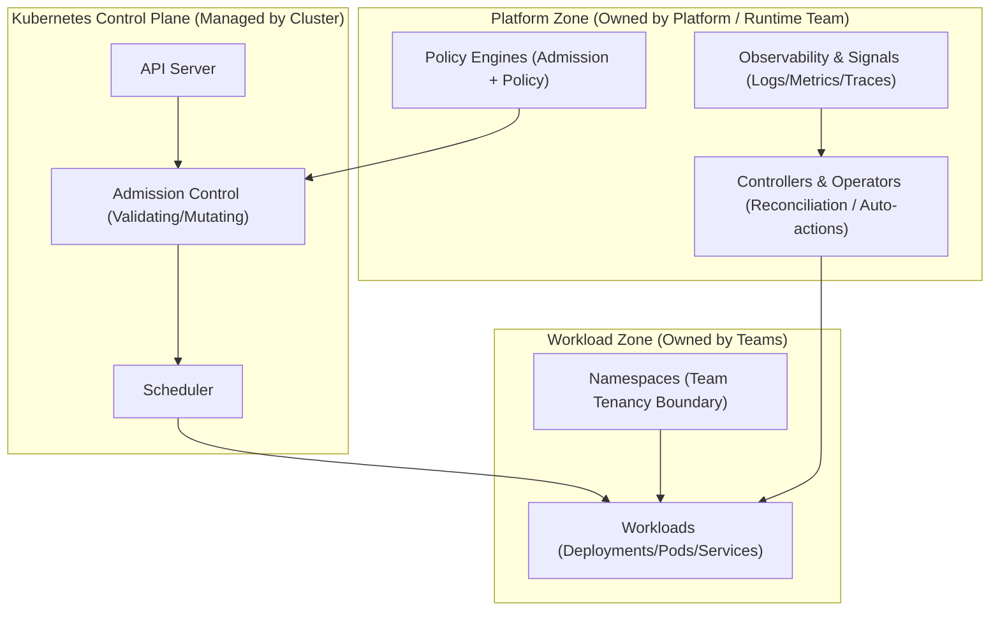
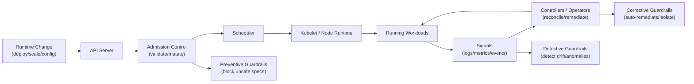

# Cluster Architecture

This document describes the **logical Kubernetes cluster architecture**
required to support **runtime guardrails** consistently, safely, and at scale.

It focuses on **responsibility boundaries and enforcement surfaces** —
not tooling, provisioning, or vendor-specific details.

---

## Purpose

The cluster architecture exists to:

- Provide stable enforcement points for runtime guardrails
- Separate platform responsibilities from workload responsibilities
- Enable preventive, detective, and corrective controls
- Scale governance without approvals or manual intervention

This architecture is designed to be **boring, predictable, and defensible**.

---

## Logical Cluster Zones

  
The diagram below provides an orientation view of the cluster by showing *ownership and responsibility boundaries* — platform-owned vs team-owned — without tool detail.

**How to read:**  
- Boxes represent **zones of responsibility**, not network boundaries  
- Arrows mean **influence / dependency**, not request flow  
- This diagram is about **who owns what**, so later guardrails don’t feel like “platform overreach”

**Why this diagram exists:**  
- Makes it explicit that guardrails are **platform-owned capabilities** applied *at cluster boundaries*  
- Protects team autonomy by clarifying that teams own **workloads**, while platforms own **enforcement surfaces**  
- Prevents confusion between “platform zone” (ownership) and “private subnet” (networking)

**Key takeaways:**  
- Teams primarily operate inside **Namespaces + Workloads**  
- Preventive guardrails are strongest at **Admission** (before a spec becomes runtime state)  
- Detective/corrective guardrails rely on **Signals + Controllers** (continuous, not gate-based)

**Links (add once those files exist):**  
- Runtime categories → `../02-runtime-model/runtime-guardrail-categories.md`  
- Cluster enforcement mapping → `policy-enforcement.md` (in this folder)

---

## Guardrail Attachment Points (Prevent / Detect / Correct)

This diagram shows *where runtime guardrails attach* in Kubernetes so the runtime model becomes concrete:
- **Preventive** guardrails happen **before** unsafe state enters the cluster
- **Detective** guardrails observe **while running**
- **Corrective** guardrails reconcile or remediate **after detection**

**How to read:**  
- Left → right is the lifecycle of a change becoming runtime state  
- “Attach” means **enforcement surface**, not tooling  
- The arrows represent **control-plane sequence**, not end-user traffic

**Why this diagram exists:**  
People often think “guardrails” are pipeline gates. This diagram shows why runtime guardrails are different:
they attach to Kubernetes enforcement surfaces that operate **continuously**, not just at deploy time.

**What each attachment point means (conceptually):**
- **Admission → Preventive**  
  The strongest place to stop misconfigurations (because nothing is running yet).
- **Signals → Detective**  
  The system can’t prevent everything; it must detect drift and unsafe runtime behavior.
- **Controllers → Corrective**  
  Kubernetes is a reconciliation engine: corrective guardrails bring the system back to a safe state.

**Cross-links to add (or verify):**
- Runtime categories: `../02-runtime-model/runtime-guardrail-categories.md`
- Policy enforcement (how admission works): `policy-enforcement.md`
- Runtime detection patterns: `../04-implementation-patterns/config-and-secrets.md` and `../08-opinionated-implementations/kubernetes/runtime-detection.md`
- Corrective patterns: `../08-opinionated-implementations/kubernetes/corrective-patterns.md`

**Important note:**  
This diagram is intentionally **tool-neutral** (no Kyverno/Gatekeeper/etc.).  
Tool choices come later under `08-opinionated-implementations/`.

---

## What This Architecture Is (and Is Not)

**This is:**
- A reference model for runtime enforcement
- A logical view of cluster responsibilities
- A foundation for guardrails, not workloads

**This is not:**
- A cluster build guide
- A hardening checklist
- A replacement for team ownership

---

## Cluster Responsibilities

At runtime, the cluster is responsible for:

1. Enforcing platform-wide safety boundaries
2. Preventing unsafe states from entering the system
3. Detecting drift and violations
4. Supporting automated correction where appropriate

The cluster does **not**:
- Decide application behavior
- Own business logic
- Replace team-level operational responsibility

---

## Key Control-Plane Surfaces

Runtime guardrails attach to specific Kubernetes surfaces:

### API Server
- Entry point for all desired state changes
- Primary surface for **preventive guardrails**

Examples:
- Admission control
- Policy enforcement
- Spec validation

---

### Controllers
- Reconcile desired and actual state
- Primary surface for **corrective guardrails**

Examples:
- Auto-remediation
- Rollback
- Isolation

---

### Nodes & Runtime
- Execute workloads
- Source of runtime signals

Examples:
- Resource pressure
- Pod lifecycle events

---

### Observability Pipeline
- Aggregates runtime signals
- Primary surface for **detective guardrails**

Examples:
- Drift detection
- Behavioral monitoring
- Policy violation signals

---

## Logical Cluster Zones

For guardrail purposes, clusters can be reasoned about in **logical zones**:

### Platform Zone
- Shared components
- Guardrail enforcement mechanisms
- Policy engines
- Observability infrastructure

Owned by: Platform team

---

### Workload Zone
- Application namespaces
- Team-owned workloads
- Service-specific configurations

Owned by: Application teams

---

### Control Zone
- Admission
- Controllers
- Cluster-wide policies

Owned by: Platform team

---

## Guardrail Attachment Points

| Guardrail Type | Primary Attachment |
|---------------|-------------------|
| Preventive | API Server / Admission |
| Detective | Observability pipeline |
| Corrective | Controllers / Operators |

This mapping ensures:
- Early prevention where possible
- Continuous detection where necessary
- Automated correction where safe

See:
- `02-runtime-model/runtime-guardrail-categories.md`

---

## Design Constraints

This architecture intentionally enforces the following constraints:

- Guardrails are **centralized**, not per-team
- Enforcement is **consistent** across environments
- Teams cannot bypass guardrails accidentally
- Exceptions are explicit and visible

---

## What This Architecture Avoids

- Inline human approvals
- Per-namespace policy engines
- Tool-specific coupling
- Environment-specific behavior drift

Those concerns are handled elsewhere.

---

## How This Connects to the Rest of the Repository

This document connects to:

- **Runtime Model**  
  → `02-runtime-model/`

- **Implementation Patterns**  
  → `04-implementation-patterns/`

- **Rollout Playbooks**  
  → `06-rollout-playbooks/`

- **Architecture at a Glance**  
  → `ARCHITECTURE-AT-A-GLANCE.md`

---

## Key Takeaway

> **The cluster is the enforcement substrate.  
> Guardrails succeed when they are architectural, not procedural.**