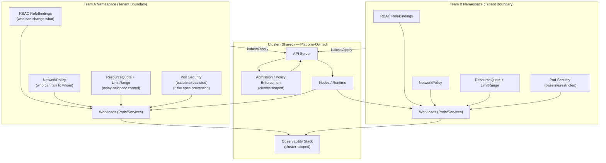
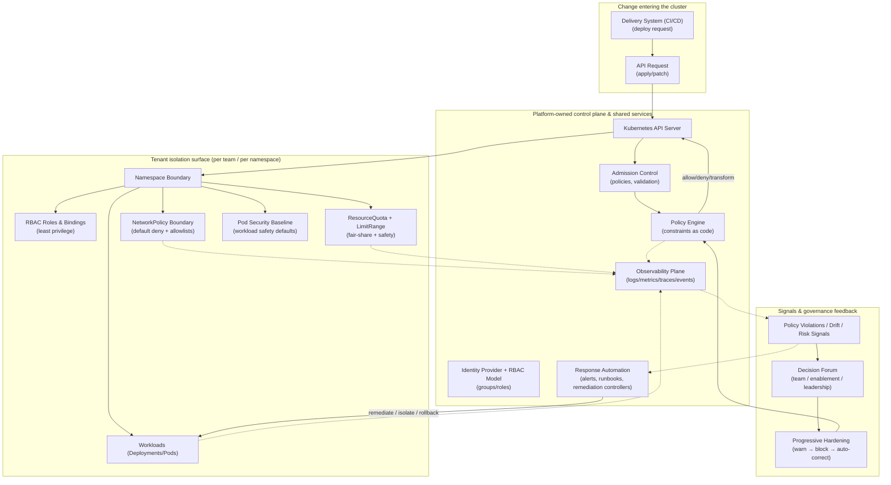

# Multi-Tenancy & Isolation

## Multi-Tenant Cluster Isolation Boundaries

**Purpose:**  
Show how a shared Kubernetes cluster can safely host multiple teams by making **tenancy boundaries explicit**.

This diagram answers:
- “What is the tenant boundary in Kubernetes?”
- “What is isolated per team vs shared cluster-wide?”
- “Where do namespaces, RBAC, NetworkPolicy, quotas, and Pod Security fit together?”

**How to read:**  
- **Namespace** is the *primary* tenancy boundary for workloads  
- **RBAC** controls who can do what (API permissions)  
- **NetworkPolicy** controls who can talk to whom (network permissions)  
- **Quotas/LimitRanges** prevent noisy-neighbor resource exhaustion  
- **Pod Security** prevents risky runtime configurations  
- Some controls are **cluster-scoped** (platform-owned), some **namespace-scoped** (team-owned with constraints)

## Key Points From The Diagram

### 1) Namespace is the tenancy boundary (not the node)
Multiple teams can share nodes safely if their workload boundaries are enforced at the API and runtime layers.

### 2) Isolation is layered (not a single control)
A safe multi-tenant setup relies on multiple controls working together:

- **RBAC** prevents unauthorized API actions (e.g., Team A can’t edit Team B’s objects)
- **NetworkPolicy** prevents unwanted network access (e.g., deny-all by default, allow explicit)
- **ResourceQuota + LimitRange** prevents resource starvation and runaway usage
- **Pod Security** prevents risky container runtime capabilities and unsafe specs
- **Admission / Policy Enforcement** ensures the cluster never accepts disallowed configurations

### 3) Cluster-scoped vs Namespace-scoped (ownership clarity)
- **Cluster-scoped controls** are platform-owned because they protect *everyone*:
  - Admission/policy enforcement
  - Default-deny baselines
  - Global observability and audit
- **Namespace-scoped controls** can be team-managed within guardrails:
  - Fine-grained RBAC bindings
  - Allow-list NetworkPolicies for dependencies
  - Namespace quotas aligned to team capacity

## Cross-links to Add (or verify)
- Implementation patterns:
  - RBAC: `../04-implementation-patterns/namespaces-and-rbac.md`
  - Network policies: `../04-implementation-patterns/network-policies.md`
  - Resource baselines: `../04-implementation-patterns/resource-baselines.md`
  - Pod Security: `../04-implementation-patterns/pod-security-standards.md`
- Starter assets (defaults you can apply immediately):
  - `../05-starter-assets/manifests/namespace.yaml`
  - `../05-starter-assets/manifests/default-networkpolicy-deny.yaml`
  - `../05-starter-assets/manifests/resourcequota.yaml`
  - `../05-starter-assets/manifests/limitrange.yaml`

> “In Kubernetes, tenancy isn’t one feature — it’s a layered boundary: namespace + RBAC + network policy + resource limits + pod security, enforced at admission and validated by signals.”

## Multi-tenancy & Isolation Architecture

**Why this exists (1 line):** The “Isolation Boundaries” diagram shows *where* isolation exists; this section shows *how* isolation is enforced, owned, and evolved over time.

This diagram explains:
- **Ownership:** what the platform owns vs what teams own
- **Enforcement surfaces:** where isolation is actually enforced (admission, runtime, network, quotas)
- **Evolution:** how controls harden from dev → prod without adding human gates

> See also: **Isolation Boundaries** (static containment model) in this same document.

### Multi-tenancy & Isolation Architecture (ownership + enforcement)

### How to Read This Diagram

- **Platform-owned** components (top-left) define the “rules of the road” and enforcement points.
- **Tenant isolation surface** (middle) is where teams live: namespaces and their guardrails.
- **Change flow** (left) shows how deployments enter and are evaluated.
- **Feedback loop** (bottom-right) shows how signals lead to better policies over time.

This is an **architecture diagram**, not a tool diagram:
- No vendor choices
- No YAML
- No single “right” product
- Focus is on **responsibility boundaries** and **enforcement surfaces**

---

## What This Diagram Adds Beyond “Isolation Boundaries”

The Isolation Boundaries view answers:  
> “How far can a failure or misconfiguration spread?”

This Architecture view answers:  
> “How do we *consistently enforce* those boundaries without human gates?”

Specifically, it adds:
- **Ownership clarity** (platform vs teams)
- **Where enforcement happens** (admission, policy engine, runtime controls)
- **How enforcement evolves** (progressive hardening)
- **How exceptions are handled** (signals → decision forum → policy changes)

---

## Practical Interpretation (What Each Role Does)

### Platform / Runtime Team
Owns:
- Admission policies and enforcement level strategy
- RBAC group model and tenant onboarding patterns
- Baseline NetworkPolicy, quotas, and pod security baselines
- Observability + response automation integration

### Engineering Teams
Own:
- Namespace-level configuration within constraints
- Service-to-service allowlists required for their workloads
- Remediation of violations surfaced by signals
- Evidence and exception requests (when needed)

### Security / Risk / Compliance
Own:
- Control objectives and acceptable risk posture
- Required policy categories (e.g., isolation, least privilege)
- Audit expectations (e.g., exceptions, enforcement levels, evidence)

---

## Links to Related Sections

- **Runtime Guardrail Categories:** `../../02-runtime-model/runtime-guardrail-categories.md`
- **Enforcement Levels:** `../../02-runtime-model/enforcement-levels.md`
- **Admission Control Patterns:** `../../04-implementation-patterns/admission-control.md`
- **Network Policies:** `../../04-implementation-patterns/network-policies.md`
- **Namespaces & RBAC:** `../../04-implementation-patterns/namespaces-and-rbac.md`
- **Progressive Hardening:** `../../04-implementation-patterns/progressive-hardening.md`
