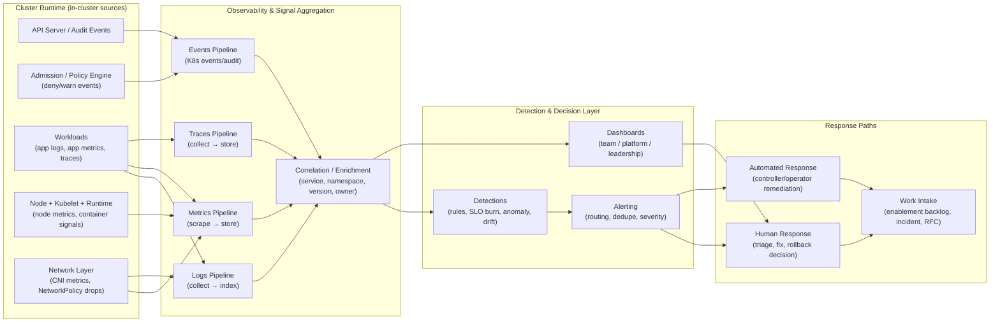

# Observability Architecture

## Runtime Signals → Detection → Response

**Purpose:**  
Show how runtime guardrails rely on **signals** (metrics/logs/traces/events) to detect violations, diagnose impact, and trigger corrective action.

This diagram answers:
- “Where do runtime signals come from?”
- “How do we detect drift, violations, or risky behavior?”
- “What’s the path from signal → alert → action?”

**How to read:**  
- Left to right = signal flow  
- Top = in-cluster sources  
- Middle = aggregation/correlation  
- Right = response paths (human + automated)

## Key Points From The Diagram

### 1) Guardrails without signals are theater
Preventive controls reduce risk, but **detective signals** are what prove:
- what’s actually happening at runtime
- whether drift is occurring
- whether enforcement is creating friction or stability

### 2) “Correlation / Enrichment” is the difference between noise and action
Raw telemetry is rarely usable until it is enriched with:
- namespace / workload identity
- owning team or service boundary
- deployment version / image tag
- environment / cluster identity
- policy name / control ID

This is what makes alerts:
- routable to the right responders
- debuggable without tribal knowledge
- safe to use as decision-support (not blame)

### 3) Responses are deliberately both human and automated
Runtime safety improves when:
- **low-risk, well-understood issues** can be auto-remediated
- **high-impact or ambiguous issues** are escalated to humans
- both paths produce a trackable artifact (ticket/incident/RCA)

## What belongs where (quick mapping)

- **Events/Audit** → policy enforcement visibility (admission decisions, API changes)
- **Metrics** → saturation, latency, error rates, SLOs, anomaly detection
- **Logs** → forensic detail, root cause analysis, debugging
- **Traces** → dependency chains and latency hotspots
- **Dashboards** → trends and decision-making, not point-in-time micromanagement

## Cross-links to add (or verify)
- Runtime model categories:
  - `../02-runtime-model/runtime-guardrail-categories.md`
- Dashboards & decision contexts (later, if/when added):
  - Team / Enablement / Leadership dashboard relationship docs (future)
- Corrective patterns (auto remediation examples):
  - `../08-opinionated-implementations/kubernetes/corrective-patterns.md`
- Runtime detection examples:
  - `../08-opinionated-implementations/kubernetes/runtime-detection.md`

## Talk track (one-liner for interviews)
> “Runtime guardrails are only trustworthy with signal pipelines that correlate policy events and runtime telemetry into actionable detections, routed to humans or automation based on risk.”