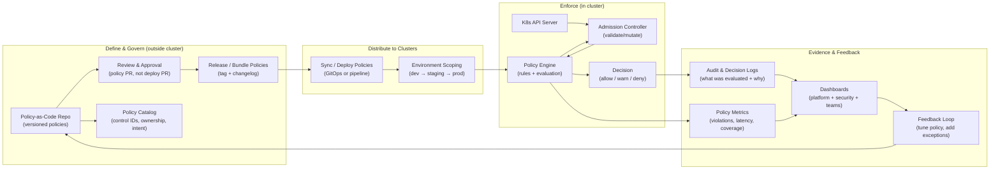

# Policy Enforcement Architecture

## From Policy Definition → Enforcement → Evidence

**Purpose:**  
Show the end-to-end path of runtime policy: how policies are authored, versioned, deployed, enforced, and evidenced — without naming a specific tool as “required.”

This diagram answers:
- “Who defines runtime policy, and where does it live?”
- “How does policy get enforced in-cluster?”
- “How do we produce evidence for security/compliance without manual approvals?”

**How to read:**  
- Left to right = lifecycle (define → distribute → enforce → evidence)  
- Top lane = policy authoring/governance  
- Middle lane = cluster enforcement path  
- Bottom lane = evidence/feedback loops (auditability + learning)

## What This Diagram Is Trying to Teach

### 1) “Policy approval” is not “deploy approval”
We want the organization to approve **policy changes** (the rules of the road),
but we do **not** want every application deployment to require new approvals.

**Best practice pattern:**
- policy changes go through PR review with security/platform governance
- workloads are deployed continuously against already-approved policy bundles

### 2) Enforcement must produce explainable evidence
Runtime policy becomes credible when you can answer:
- **What policy fired?**
- **What object was evaluated?**
- **What was the decision (warn/deny)?**
- **Why was it decided that way?**
- **How often is it happening and where?**

That evidence powers:
- auditability (compliance)
- learning loops (improving policy design)
- trust (teams can understand failures quickly)

### 3) Environment scoping is part of enforcement maturity
Policies are rarely “perfect” on day one.
So we intentionally scope by environment:
- **dev:** observe / warn
- **staging:** warn / limited deny
- **prod:** deny for high-risk classes + controlled exceptions

This aligns with the **warn → block → auto-correct** progression.

## What belongs where (quick mapping)

- **Policy Repo**: policies, tests, rationale, exception process, ownership
- **Catalog**: control IDs, intent, scope, enforcement level by environment
- **Sync**: how policies arrive in clusters (GitOps/pipeline), immutability and rollback
- **Admission/Policy Engine**: fast, deterministic decisions at API boundary
- **Evidence**: logs + metrics + dashboards that support decisions, not blame

## Common failure modes (what to avoid)

- “Silent deny” with no explanation → teams route around the platform
- “Policy sprawl” with no ownership → no one can safely change rules
- “All-or-nothing enforcement” too early → breaks trust and causes rollback
- No metrics on policy performance → enforcement becomes political

## Cross-links to add (or verify)

- Runtime model (categories + enforcement levels):
  - `../02-runtime-model/runtime-guardrail-categories.md`
  - `../02-runtime-model/enforcement-levels.md`
- Progressive hardening rollout pattern:
  - `../04-implementation-patterns/progressive-hardening.md`
- Opinionated enforcement examples:
  - `../08-opinionated-implementations/kubernetes/admission-policies.md`
  - `../08-opinionated-implementations/policy-as-code/decision-guide.md`

## Talk track (one-liner for interviews)
> “We approve policy once—via PR—then enforce it automatically at the Kubernetes API boundary, producing explainable evidence and tuning loops instead of manual deployment gates.”