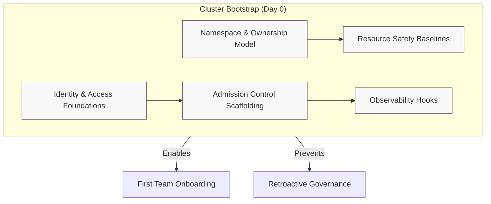

# Bootstrapping a Kubernetes Cluster

## Purpose

Bootstrapping a cluster is **not an infrastructure task** — it is a **governance decision**.

The choices made at cluster creation time determine:
- What is *possible* vs *impossible* for workloads
- How much policy must be enforced later
- Whether guardrails feel invisible or intrusive

This playbook describes **what must exist before the first workload ever runs**.

---

## What Cluster Bootstrap Is (and Is Not)

### Bootstrap *is*:
- Establishing **non-negotiable platform defaults**
- Encoding organizational risk tolerance
- Creating a stable contract teams can rely on

### Bootstrap is *not*:
- Team onboarding
- Environment-specific tuning
- Application-level customization
- Full production hardening

> If something can be deferred safely, it should be.

---

## Non-Negotiables at Bootstrap

These elements should exist **on day zero**, even if enforcement is initially permissive.

### 1. Identity & Access Foundations

- Cluster authentication integrated with central identity
- Clear separation between:
  - Platform operators
  - Enablement tooling
  - Application teams
- No shared human-admin credentials

**Why:**  
Identity mistakes are hardest to unwind later.

---

### 2. Namespace & Ownership Model

- Predefined namespace strategy (even if minimal)
- Explicit ownership expectations
- No “default namespace for everything”

**Why:**  
Namespaces are the first and most durable isolation boundary.

---

### 3. Resource Safety Baselines

- Default resource requests and limits
- Basic quota guardrails (warn-only is acceptable initially)
- Protection against cluster-wide exhaustion

**Why:**  
Resource starvation incidents are common and preventable.

---

### 4. Admission Control Scaffolding

At bootstrap time:
- Admission control *exists*
- Policies may start in **observe or warn mode**
- Enforcement can be progressive

Examples:
- Policy engines installed
- Baseline policies registered but non-blocking

**Why:**  
Installing admission control later is harder politically and operationally.

---

### 5. Observability Hooks

- Cluster emits:
  - Audit events
  - Policy decisions
  - Runtime signals
- Central aggregation wired, even if dashboards come later

**Why:**  
You cannot improve what you cannot see.

---

**How to read this diagram**

- Everything inside **Cluster Bootstrap** must exist before workloads run
- These are **foundational guardrails**, not team-specific controls
- Enforcement may start permissive, but structure must exist
- Bootstrap enables onboarding — not the other way around

If a control is added *after* onboarding begins, it will feel like friction.

---
## What We Explicitly Do *Not* Solve at Bootstrap

To avoid overreach, bootstrap intentionally avoids:

- Per-team exceptions
- Environment-specific overrides
- Workload-level policy tuning
- Release process controls

These belong in:
- Team onboarding
- Progressive hardening
- Environment promotion playbooks

---

## Example: Bootstrapping a Shared Platform Cluster

**Context:**  
A new regional cluster intended to host multiple product teams.

**Bootstrap decisions:**
- Central identity integration enabled
- Namespaces created per product area
- Admission policies installed in warn-only mode
- Resource defaults applied globally
- Network policies *defined*, but not yet restrictive

**What this enabled later:**
- Teams onboarded without bespoke setup
- Policies moved from warn → enforce gradually
- No retroactive “surprise” constraints
- Clear audit trail from day one

**What was avoided:**
- Emergency retrofits
- Blanket production freezes
- Trust erosion with teams

---

## Signals Bootstrap Was Done Well

You’ll know bootstrap worked when:
- Guardrails feel unsurprising
- Teams rarely hit “sudden” enforcement
- Platform changes are incremental, not disruptive
- New clusters look boring (this is good)

## Signals Bootstrap Was Insufficient

Warning signs include:
- Needing manual approvals to compensate
- Late introduction of admission control
- Cluster-wide incidents from single workloads
- Policy rollouts framed as “new restrictions”

---

## Key Principle

> **Bootstrap defines the safety envelope — not the workflow.**

A well-bootstrapped cluster allows:
- Faster delivery later
- Fewer exceptions
- Less enforcement pressure

Most guardrail pain is caused by *missing defaults*, not strict policies.

---

## Next Playbooks

Once a cluster is bootstrapped:
- **Onboarding a Team** → applying guardrails incrementally
- **Moving from Dev to Prod** → increasing enforcement safely
- **Incident Readiness** → validating guardrails under stress
