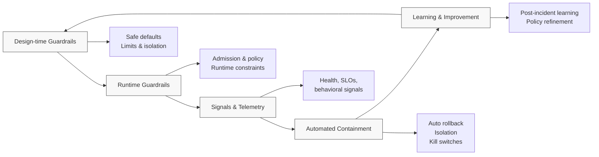

# Incident Readiness Through Guardrails

This playbook explains how **incident readiness is designed into the platform**
rather than handled as an operational afterthought.

The goal is not to prevent all incidents.
The goal is to ensure incidents are:
- Detectable quickly
- Contained automatically
- Recoverable without heroics

Incident readiness emerges from **guardrails + signals + practiced recovery**.

---

## Core Principle

> **If you need a human to make the system safe, the system is incomplete.**

Humans lead incidents.
Systems must handle:
- Detection
- Containment
- Safe defaults
- Fast rollback

---

## Guardrail-Centered Incident Readiness Model

## How to Read This Diagram

- Incident readiness is **cyclical**, not reactive
- Guardrails operate *before*, *during*, and *after* incidents
- Learning feeds back into stronger defaults

This is not an escalation flow.
It is a **system resilience loop**.

---

## Design-Time Guardrails

**Intent:** Reduce blast radius before anything runs

Examples:
- Resource limits and requests
- Pod disruption budgets
- Namespace and identity isolation
- Default network boundaries

Design-time guardrails ensure:
- No single workload can exhaust shared capacity
- Failure is constrained by default

---

## Runtime Guardrails

**Intent:** Prevent unsafe states from entering or persisting

Examples:
- Admission policies blocking dangerous specs
- Immutable infrastructure rules
- Policy enforcement on config changes

Runtime guardrails stop incidents **from compounding**.

---

## Signals & Telemetry

**Intent:** Detect failure modes early and accurately

Signals should answer:
- Is the system healthy?
- Is behavior changing?
- Is risk increasing?

Examples:
- Error rates and latency
- Restart loops or crash patterns
- Policy violations over time
- Resource saturation trends

Signals must be:
- Actionable
- Low-noise
- Trusted

---

## Automated Containment

**Intent:** Act faster than humans can

Examples:
- Automatic rollback on failed deploys
- Feature flag disablement
- Traffic shedding or isolation
- Quarantine of misbehaving workloads

Containment guardrails:
- Reduce customer impact
- Buy time for humans
- Prevent cascading failures

---

## Learning & Improvement

**Intent:** Ensure incidents strengthen the system

Post-incident outcomes should include:
- Guardrail gaps identified
- Defaults adjusted
- Policies refined
- Signals improved

If the same incident can happen twice the same way,
the system did not learn.

---

## What This Replaces

This model replaces:
- Runbooks as primary defense
- Hero-driven recovery
- Manual safety switches
- Incident-only fixes

With:
- Continuous protection
- Predictable recovery
- System-level resilience

---

## Key Takeaways

- Incident readiness is a **platform capability**
- Guardrails matter most *before* humans engage
- The best incident response starts long before the incident

If recovery depends on luck or expertise alone,
guardrails are insufficient.
