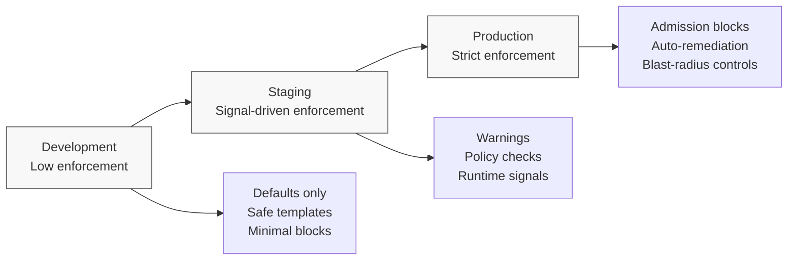

# Moving a Team from Dev to Prod Safely

This playbook describes how teams move from **development environments to production**
without introducing last-minute approvals, manual gates, or brittle controls.

The goal is to:
- Increase enforcement **gradually**
- Build confidence through **signals, not trust assumptions**
- Ensure production safety without slowing delivery

This is not a checklist.
It is a **progressive system design**.

---

## Core Principle

> **Production readiness is demonstrated by behavior, not paperwork.**

Teams do not “graduate” to production because they passed a review.
They progress because their systems demonstrate:
- Predictability
- Recoverability
- Safe failure modes

---

## Conceptual Progression: Dev → Staging → Production

## How to Read This Diagram

- Environments are **not just copies** with different scale
- Each environment introduces **new enforcement responsibilities**
- Progression is based on **observed behavior**, not time or approvals

The same guardrails exist everywhere - but their **strength and consequences change**.

---

## Development Environment

**Intent:** Enable fast feedback and learning

Characteristics:
- Safe defaults applied automatically
- Minimal blocking controls
- Violations produce signals, not failures

Typical guardrails:
- Resource baselines
- Namespace isolation
- Non-blocking policy evaluation
- Logging and telemetry enabled

What teams learn here:
- How guardrails behave
- What signals are emitted
- How violations are reported

---

## Staging Environment

**Intent:** Validate production readiness signals

Characteristics:
- Policies evaluated in “warn” mode
- Drift detection enabled
- Runtime behavior observed over time

Typical guardrails:
- Admission policies in audit mode
- Policy-as-code warnings
- Release configuration validation
- Dependency and configuration drift checks

What the platform learns here:
- Which policies are noisy
- Where false positives exist
- Whether enforcement is safe

Staging is where **confidence is earned**.

---

## Production Environment

**Intent:** Protect customers and the platform

Characteristics:
- Enforcement is strict and automated
- Unsafe states are blocked or corrected
- Recovery is system-driven, not human-driven

Typical guardrails:
- Admission control (block unsafe specs)
- Network and identity isolation
- Resource quotas and disruption budgets
- Automated rollback or isolation

At this point:
- Guardrails are predictable
- Teams trust the system
- Approvals are unnecessary

---

## What This Replaces

This progression replaces:
- Production readiness reviews
- Manual sign-offs
- Environment-specific checklists
- Emergency exceptions

With:
- Continuous validation
- Progressive enforcement
- System-level confidence

---

## Key Takeaways

- Dev → Prod is a **change in consequences**, not tooling
- Enforcement should never appear suddenly
- Guardrails succeed when teams experience:
  - Fewer surprises
  - Faster recovery
  - Clear expectations

If production feels scary, the system — not the team — is unfinished.
