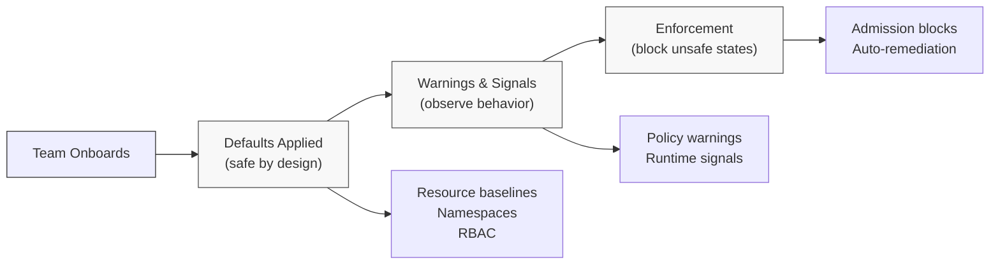

# Onboarding a Team

## Purpose

This playbook describes **how teams are onboarded** onto a Kubernetes platform
with runtime guardrails in a way that builds trust, clarity, and adoption.

The goal is to ensure that:
- Teams understand *why* guardrails exist
- Guardrails feel predictable and fair
- Teams retain autonomy within clear boundaries

This is not a training guide.
It is a **social and technical onboarding model**.

---

## When This Playbook Applies

Use this playbook when:
- A new team is adopting the Kubernetes platform
- Existing teams are migrating from legacy platforms
- Guardrails are being introduced to previously unrestricted clusters

This playbook assumes:
- The cluster has already been bootstrapped correctly
- Baseline guardrails exist (even if permissive)

---

## Core Principle

> **Teams should encounter guardrails as guidance first, enforcement later.**

Onboarding should reduce fear, not increase it.

---

## Onboarding Phases

### 1. Establish Shared Understanding

Before a team deploys anything:
- Explain *what guardrails exist*
- Explain *what problems they solve*
- Explain *what they do NOT do*

Key messages:
- Guardrails protect the platform, not judge teams
- Guardrails prevent classes of failure
- Guardrails apply consistently to everyone

If teams do not understand intent, enforcement will be resisted.

---

### 2. Start With Visibility, Not Blocking

Initial onboarding should emphasize:
- Warnings
- Audit signals
- Non-blocking feedback

This allows teams to:
- See how guardrails work
- Learn what “good” looks like
- Adjust without pressure

Blocking too early turns onboarding into escalation.

---

### 3. Make Boundaries Explicit

Teams should clearly know:
- What they own
- What the platform owns
- Where responsibility changes

This typically includes:
- Namespace boundaries
- Resource quotas
- Security expectations

Ambiguity creates friction. Clarity builds trust.

---

### 4. Provide Safe Paths Forward

Every guardrail should come with:
- A clear error message
- A recommended fix
- A known escalation path (when exceptions are valid)

Teams should never feel “stuck” by guardrails.

---

### 5. Harden Gradually, Predictably

As teams gain confidence:
- Enforcement can move from warn → block
- Expectations can increase
- Defaults can become stricter

This progression should be:
- Communicated in advance
- Applied consistently
- Backed by data and examples

Surprise hardening erodes trust.

---

## Signals of Successful Onboarding

Onboarding is working when:
- Teams self-correct before violations occur
- Platform questions decrease over time
- Guardrails are referenced positively in retrospectives
- Teams advocate for guardrails with new teams

If teams bypass guardrails, onboarding has failed.

---
## How Teams Enter The Platform

**How to read this diagram**

- Teams start with **safe defaults**, not strict enforcement
- Early signals are used to understand behavior, not punish it
- Enforcement is introduced only after:
  - Patterns are understood
  - Tooling is proven
  - Teams have feedback loops

Progression is driven by **confidence**, not calendar time.

---

## Common Failure Modes

- Guardrails introduced without explanation
- Blocking enforced on day one
- Inconsistent exceptions across teams
- Platform teams acting as gatekeepers instead of enablers

---

## Leadership Role

Leadership must:
- Publicly reinforce guardrail intent
- Protect platform teams from “just make an exception” pressure
- Frame guardrails as system investment, not control

Without leadership alignment, onboarding degrades quickly.

---

## Key Takeaway

> **Successful onboarding makes guardrails feel inevitable — not imposed.**

Teams should feel safer *because* of the platform, not constrained by it.
