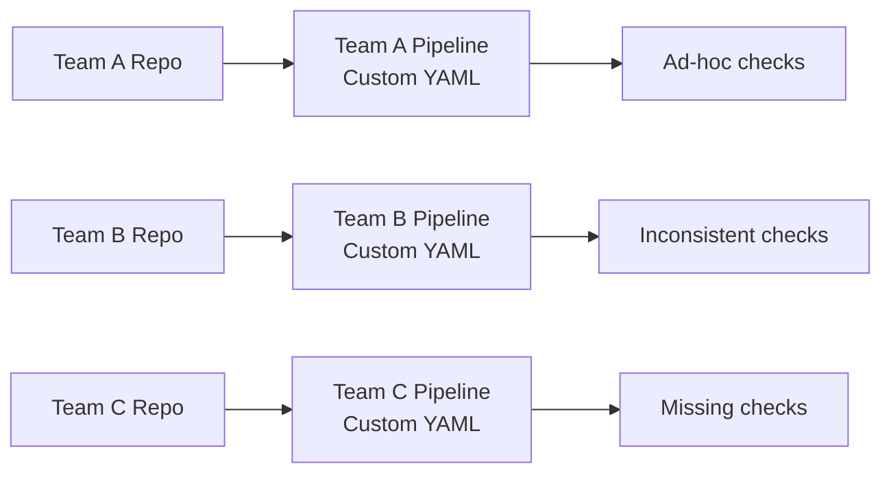
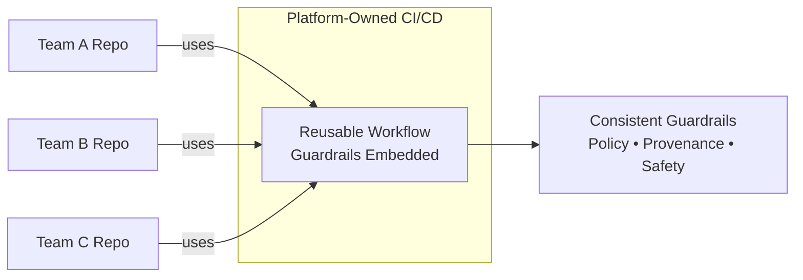
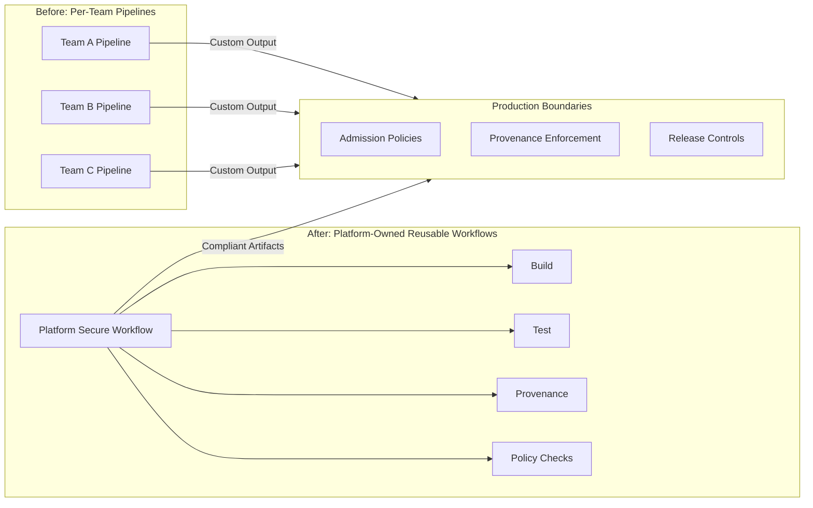

# GitHub Actions — Opinionated Guardrail Implementations

This section provides **concrete, opinionated examples** of how CI/CD guardrails
can be implemented using **GitHub Actions** — without re-introducing
manual approvals, ticket gates, or bespoke pipeline logic.

These examples exist to make the **guardrail model tangible**, not to prescribe
a single correct implementation.

---

## Purpose

This folder demonstrates:

- How **platform-owned reusable workflows** replace per-team pipelines
- How **guardrails are injected centrally** without blocking autonomy
- How enforcement progresses safely from **observe → warn → block**
- How CI/CD guardrails integrate cleanly with **runtime (Kubernetes) guardrails**

The focus is on **patterns**, not YAML cleverness.

---

## What These Examples Show

The GitHub Actions examples illustrate:

- Guardrails enforced via **reusable workflows**
- Centralized policy logic with **distributed execution**
- Clear separation between:
  - *What teams control*
  - *What platforms enforce*

They intentionally avoid:
- Complex workflow syntax
- Tool-specific optimizations
- Advanced GitHub features that obscure intent

---

## Core Guardrail Patterns Demonstrated

### 1. Reusable Workflows as Guardrail Injection Points

Guardrails are implemented as:
- Platform-owned reusable workflows
- Consumed by application repositories
- Versioned and evolved independently

This ensures:
- Consistency across teams
- Faster updates to policy
- Reduced cognitive load for developers

See:
- `reusable-workflows.md`

---

### 2. Progressive Enforcement (Warn → Block)

Examples show how to:
- Start with visibility-only checks
- Escalate to warnings
- Eventually enforce blocking behavior

This avoids:
- Breaking pipelines unexpectedly
- Eroding trust
- Creating “shadow pipelines”

See:
- `progressive-hardening.md`

---

### 3. Admission-Oriented Thinking (Before Runtime)

CI/CD guardrails focus on:
- What can be validated *before* deploy
- What must be guaranteed *before artifacts reach the cluster*

This includes:
- Artifact provenance
- Policy conformance
- Release controls

See:
- `admission-control.md`

---

## Folder Structure

```text
github-actions/
├── README.md
├── admission-control.md
├── progressive-hardening.md
└── example-repos/

```
---
## Before vs After: From Per-Team Pipelines to Platform-Owned Workflows

This model replaces **bespoke, team-owned CI/CD pipelines** with
**platform-owned reusable workflows** that embed guardrails by default.

The goal is not central control — it is **consistent safety with minimal friction**.

---

## Before: Per-Team Pipelines (High Drift, High Cognitive Load)

Each team owns and maintains its own pipeline logic.



---

Teams reference **shared, versioned workflows** owned by the platform.



**Characteristics**
- Guardrails defined once, applied everywhere
- Teams supply inputs, not policy logic
- Enforcement evolves centrally (observe → warn → block)
- Platform changes propagate safely and predictably

**Result**
- Consistent governance without approvals
- Reduced cognitive load for teams
- Faster onboarding and safer scaling
- Trust is enforced by the system, not people

---

## What Changes for Teams

Before:
- “Did we remember to add the right checks?”

After:
- “The pipeline already guarantees the required properties.”

Teams:
- Focus on delivery
- Retain autonomy
- Avoid compliance surprises

---

## What Changes for Platform Teams

Before:
- Reviewing pipelines
- Handling exceptions
- Chasing consistency

After:
- Designing guardrails
- Observing system signals
- Improving defaults over time

Governance shifts from **reviewing changes** to **designing systems**.

---

## How Teams Interact With This Model

Teams typically:
- Reference a platform-provided reusable workflow
- Supply a small, well-defined set of inputs
- Do **not** implement policy logic themselves

This preserves:
- Team autonomy
- Platform consistency
- Predictable governance

Teams are consumers of guardrails, not authors of them.

---

## How Platform Teams Use This

Platform teams:
- Own reusable workflows
- Own guardrail logic and evolution
- Control enforcement progression (observe → warn → block)
- Monitor impact through signals, not tickets or exceptions

This shifts governance from:
“Did someone approve this change?”
to:
“Does the system guarantee the required properties?”

---

## Enforcement Philosophy

Guardrails implemented here follow three core rules:

1. **Default to visibility**
   - Start by observing and surfacing signals
   - Avoid breaking pipelines early

2. **Escalate deliberately**
   - Move from warnings to blocking only after learning
   - Announce changes before enforcing them

3. **Fail fast, fail clearly**
   - When blocking is necessary, explain exactly why
   - Provide remediation guidance immediately

---

## Relationship to Runtime Guardrails

CI/CD guardrails:
- Reduce risk before deploy
- Enforce what can be known statically
- Validate artifacts, policy, and intent

Runtime guardrails:
- Protect what can only be known dynamically
- Detect drift, behavior, and unsafe states
- Correct or isolate issues automatically

These GitHub Actions examples intentionally stop at the CI/CD boundary.

Runtime enforcement patterns are covered in:
`08-opinionated-implementations/kubernetes/`

---
## How Platform-Owned Workflows Scale to Hundreds of Teams

A common concern with reusable, platform-owned workflows is:

> *“How do you ensure teams actually use them at scale?”*

The answer is **not enforcement through mandates**, but **adoption through system design**.

Platform-owned workflows succeed because they are:
- The **default path**
- The **safest path**
- Eventually, the **only supported path to production**

---

### 1. Adoption Happens at Repo Creation, Not Review Time

Reusable workflows are embedded into:
- Golden repository templates
- Starter application scaffolds
- Platform-approved service blueprints

New teams start with:

```yaml
uses: platform/secure-build@v3
```

They are never asked to invent pipelines themselves.

**Interview / review talk track:**  
> *“Most adoption happens before the first commit, not during governance reviews.”*

---

### 2. Guardrails Enforce Outcomes, Not Workflow Usage

Teams are not blocked from writing custom pipelines.

Instead, **production systems enforce requirements that only the platform workflow satisfies**, such as:
- Signed artifacts
- Provenance metadata
- Required attestations
- Release policy labels

A custom pipeline may:
- Build successfully
- Test successfully
- Even deploy to non-prod

But it will **fail safely** at production boundaries.

**Interview / review talk track:**  
> *“Teams can bypass the workflow — production simply won’t accept the output.”*

---

### 3. Progressive Enforcement Preserves Trust

Adoption follows a deliberate progression:

- Observe non-standard pipelines
- Warn and educate
- Incentivize standard paths
- Enforce at production boundaries
- Deprecate unsupported paths

This avoids surprise breakage and builds confidence.

**Interview / review talk track:**  
> *“We treat workflow adoption as a migration, not a mandate.”*

---

### 4. Support and Velocity Are Conditional

The platform team:
- Ships new features only via reusable workflows
- Troubleshoots incidents assuming standard pipelines
- Supports guardrails only on the standard path

Teams *can* go custom — but they own the complexity.

**Interview / review talk track:**  
> *“We support the platform, not every bespoke pipeline.”*

---

### The Result at Scale

At enterprise scale:
- New teams adopt by default
- Existing teams migrate organically
- Exceptions shrink over time
- Governance improves without slowing delivery

**Principal-level summary:**  
> *“We don’t enforce workflows — we enforce outcomes, and workflows are the easiest way to meet them.”*

## How This Works Visually


    
- teams own pipelines → inconsistent outputs
- platform owns workflows → consistent, compliant artifacts
- production enforces outcomes, not intent

Teams can bypass the platform — but production will not accept non-compliant outputs.

---

## Before Copying Any Examples

Before adopting any pattern here, consider:
- Your current delivery maturity
- Your tolerance for enforcement failures
- Your feedback loops when guardrails misfire

Read first:
`../disclaimers.md`

---

## Key Takeaway

CI/CD guardrails are successful when:
- Developers rarely think about them
- Failures are fast and explainable
- Governance scales without human checkpoints

If teams feel they are “fighting the pipeline,”
the guardrail design needs to be revisited.