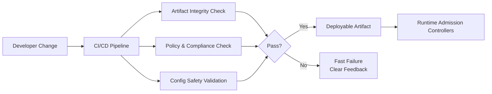
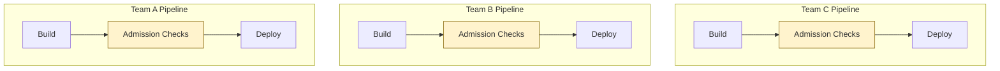
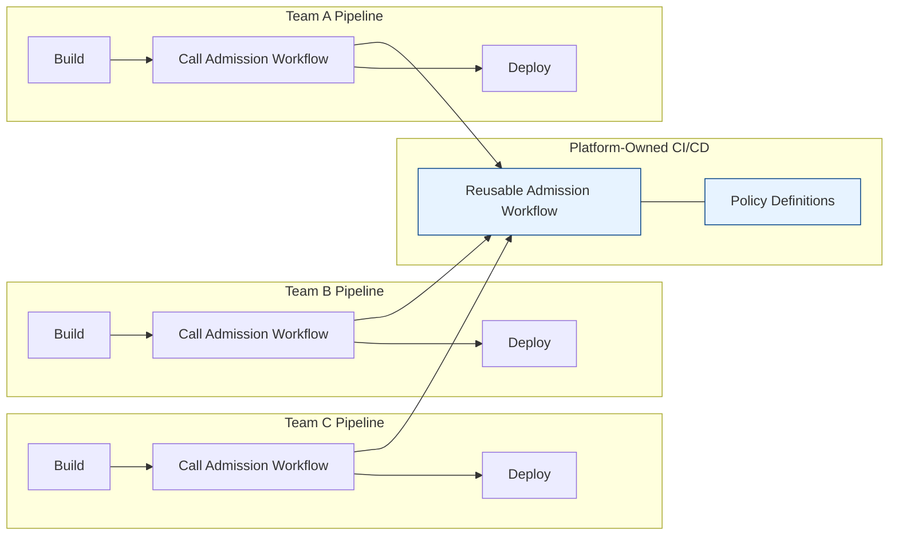

# Admission Control via CI/CD Guardrails

This document describes how **admission control concepts** are applied *before runtime*
using **CI/CD guardrails**, specifically through platform-owned GitHub Actions workflows.

The goal is to prevent unsafe artifacts and configurations from ever reaching the cluster,
reducing reliance on runtime enforcement alone.

---

## Why Admission Control Starts in CI/CD

Kubernetes admission controllers are powerful — but:

- They operate **after** a deployment attempt
- They may block teams late in the process
- They often lack rich build-time context

CI/CD guardrails complement runtime admission by:
- Shifting validation earlier (left)
- Providing faster feedback
- Enforcing policy consistently across teams

**Principle:**  
> *Anything that can be safely validated before deploy should be.*

---

## What CI/CD Admission Control Enforces

CI/CD admission guardrails typically validate:

- Artifact provenance (signed, trusted source)
- Policy compliance (organization rules)
- Configuration safety (known bad patterns)
- Release intent (environment, blast radius, flags)

These checks **do not replace runtime admission** — they reduce how often it must intervene.

---

## Conceptual Flow

## Enforcement Progression (Observe → Warn → Block)

CI/CD admission guardrails should **progress over time**, not start as hard blockers.

### Phase 1: Observe
- Policies run in report-only mode
- Violations are logged and surfaced in pipeline output
- No deployment impact

Used when:
- Introducing new policies
- Establishing baseline behavior
- Building trust with teams

---

### Phase 2: Warn
- Violations generate visible warnings
- Pipelines succeed but signal risk
- Trends are tracked over time

Used when:
- Teams understand expectations
- Violations indicate learning gaps
- Leadership wants visibility without disruption

---

### Phase 3: Block
- Violations fail the pipeline
- Unsafe artifacts never reach runtime
- Exceptions require explicit override paths

Used when:
- Policies are stable
- Tooling is trusted
- Violations represent unacceptable risk

**Key rule:**  
> Blocking is a *platform decision*, not a team negotiation.

---

## Platform-Owned vs Team-Owned Responsibilities

### Platform Owns
- Reusable admission workflows
- Policy definition and versioning
- Default enforcement levels per environment
- Auditability and transparency

### Teams Own
- Consuming approved workflows
- Fixing violations surfaced by guardrails
- Requesting policy changes via governance channels

This separation:
- Prevents policy drift
- Avoids copy-paste pipelines
- Scales governance without scaling approvals

---

## Per-Team vs Platform-Owned Admission Control

### Per-Team Admissions Check (Anti-Pattern)

Every team implements “Admission Checks”
- Logic looks similar but is never identical
- Drift is inevitable
- Enforcement strength varies silently

This is where:
- Exceptions hide
- Security reviews stall
- “Why did this deploy pass?” becomes unanswerable

---
### Platform-Owned Reusable Workflows (Target State)

- Teams invoke admission logic
- Platform owns enforcement
- Policy lives in one place
- Enforcement level is environment-aware, not team-specific

> Per-team pipelines scale risk with team count.
> Platform-owned workflows scale trust with adoption.

Or more explicitly:
- Before: Every team is a policy author
- After: Teams are policy consumers
---

## Relationship to Runtime Admission

CI/CD admission guardrails and Kubernetes admission controllers work together:

- CI/CD:
  - Prevents unsafe artifacts from being built or promoted
  - Enforces organization-wide policy early
- Runtime:
  - Protects the cluster from misconfiguration or drift
  - Catches what cannot be known at build time

**Design intent:**  
> CI/CD reduces the *frequency* of runtime blocks;  
> runtime reduces the *blast radius* of what slips through.

---

## What This Pattern Explicitly Avoids

This pattern intentionally avoids:
- Per-team custom admission logic
- Manual approval steps
- Policy exceptions hidden in pipeline YAML
- Tool-specific lock-in

The outcome is **predictable, explainable enforcement** that teams experience as guardrails — not gates.

---

## When to Use This Pattern

Use CI/CD admission control when:
- You need consistent enforcement across many teams
- Runtime blocks are too late or too disruptive
- Leadership wants risk reduction without slowing delivery

Avoid it when:
- Policies are unclear or unstable
- Feedback loops are weak
- Teams lack visibility into failures

---

## Related Documents

- **Guardrails vs Approvals**  
  `01-principles/guardrails-vs-approvals.md`

- **Enforcement Levels**  
  `02-guardrail-model/enforcement-levels.md`

- **Runtime Admission Policies**  
  `08-opinionated-implementations/kubernetes/admission-policies.md`
