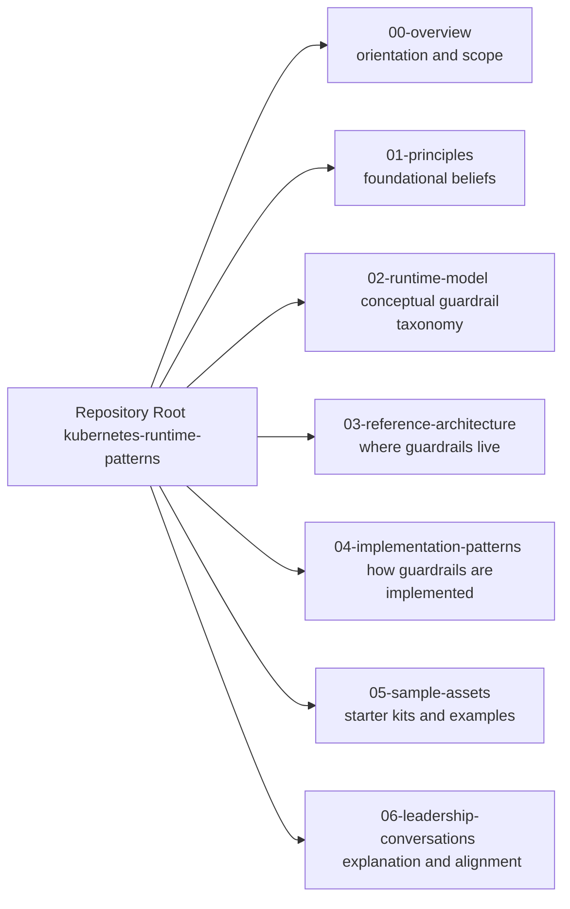
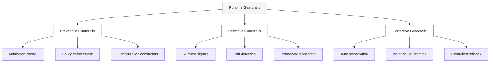

# Architecture at a Glance

This document provides a **visual orientation** to the Kubernetes Runtime Guardrails repository.

It shows **how the major conceptual areas relate to each other**, without going into implementation detail.
Use this as a map — not a specification.

## How to Use This Document

- Start with the **Repository Overview** diagram to understand scope
- Dive into a specific diagram based on the question you are asking
- Follow links from each diagram to detailed documents

You do not need to read this file top-to-bottom.

## Diagram 1: Repository Overview

**Purpose:**  
Show the major conceptual areas of this repository and how they fit together (orientation only — not flow).

**How to read:**  
- Each box is a *cohesive area* of the repository  
- Arrows mean “navigate into” (not execution order)  
- Start where your question lives; don’t read linearly

**Where to start (quick role-based entry points):**

- **Leaders** → 00-overview/, 07-leadership-conversations/
- **Platform/runtime engineers** → 02-runtime-model/, 03-reference-architecture/, 04-implementation-patterns/
- **Developers/teams** → 05-starter-assets/, plus relevant patterns in 04-implementation-patterns/

---
## Diagram 2: Runtime Guardrail Conceptual Model

**Purpose:**  
Explain *what* runtime guardrails are, *what problem they solve*, and *how they are categorized* — without tying to Kubernetes internals yet.

This diagram answers:
- “What counts as a runtime guardrail?”
- “How are guardrails different from CI/CD checks?”
- “What decisions does this model enable?”

**How to read:**  
- Guardrails are grouped by **intent**, not tooling  
- Categories are orthogonal (a single control may span more than one)
- This is a **thinking model**, not an execution pipeline

---

## Diagram Index

- Repository Overview — overall structure
- Runtime Guardrail Model — types of guardrails
- Reference Architecture — where guardrails live at runtime
- Delivery Lifecycle Injection Points — when guardrails apply