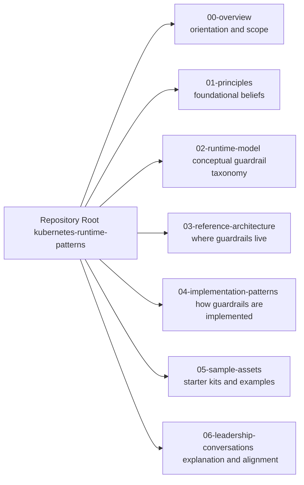
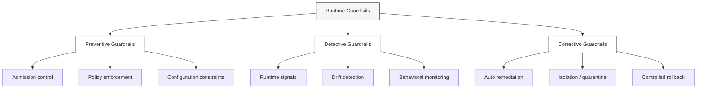
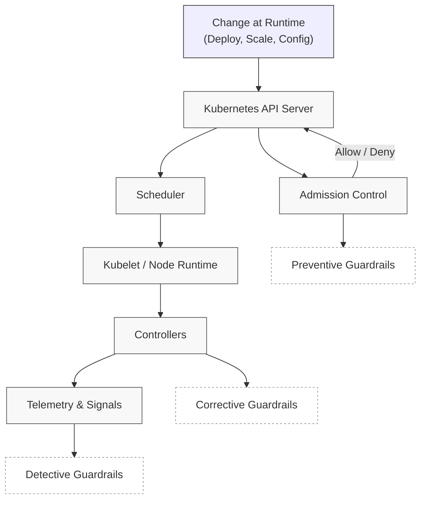
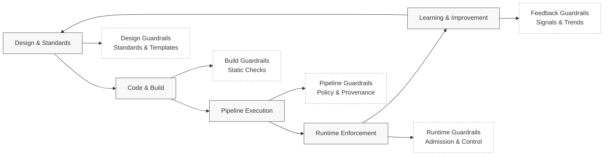
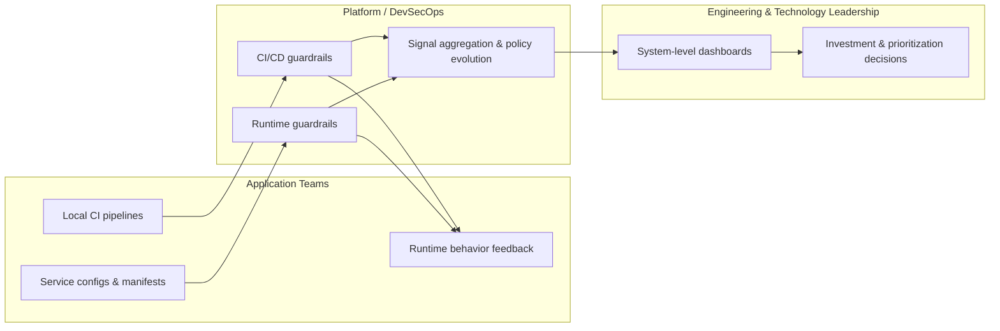

# Architecture at a Glance

This document provides a **visual orientation** to the Kubernetes Runtime Guardrails repository.

It shows **how the major conceptual areas relate to each other**, without going into implementation detail.
Use this as a map — not a specification.

## How to Use This Document

- Start with the **Repository Overview** diagram to understand scope
- Dive into a specific diagram based on the question you are asking
- Follow links from each diagram to detailed documents

You do not need to read this file top-to-bottom. 
If you can explain:
- what runtime guardrails are,
- where they live,
- who owns them,
- and why approvals are unnecessary,

you have enough context to move on to deeper sections of the repository.

## Visual Conventions Used

Across diagrams in this document:

- **Boxes** represent conceptual areas or responsibilities, not tools
- **Arrows** represent relationship or information flow — not execution order
- **Subgraphs** group concerns that evolve independently
- **Dashed or light styling** indicates intent or category, not enforcement strength

If a diagram shows execution flow, it will explicitly say so.

## Diagram 1: Repository Overview

**Purpose:**  
Show the major conceptual areas of this repository and how they fit together (orientation only — not flow).

**How to read:**  
- Each box is a *cohesive area* of the repository  
- Arrows mean “navigate into” (not execution order)  
- Start where your question lives; don’t read linearly

**Where to start (quick role-based entry points):**

- **Leaders** → 00-overview/, 07-leadership-conversations/
- **Platform/runtime engineers** → 02-runtime-model/, 03-reference-architecture/, 04-implementation-patterns/
- **Developers/teams** → 05-starter-assets/, plus relevant patterns in 04-implementation-patterns/

---
## Diagram 2: Runtime Guardrail Conceptual Model

**Purpose:**  
Explain *what* runtime guardrails are, *what problem they solve*, and *how they are categorized* — without tying to Kubernetes internals yet.

> **Scope note:**  
> Kubernetes is used as the primary reference runtime because it provides clear, enforceable control planes.  
> The guardrail concepts apply more broadly, but implementations outside Kubernetes are out of scope for this repository.

This diagram answers:
- “What counts as a runtime guardrail?”
- “How are guardrails different from CI/CD checks?”
- “What decisions does this model enable?”

**How to read:**  
- Guardrails are grouped by **intent**, not tooling  
- Categories are orthogonal (a single control may span more than one)
- This is a **thinking model**, not an execution pipeline

**Key ideas to anchor**
- **Preventive guardrails** stop unsafe states from entering the system
- **Detective guardrails** surface risk while the system is running
- **Corrective guardrails** reduce blast radius and restore safety automatically

**Important constraints**
- Guardrails protect the platform, not punish teams
- Enforcement increases with maturity (warn → block → auto-correct)
- Humans define policy; systems enforce it consistently

**Where to go next**
- Canonical definitions: [`02-runtime-model/runtime-guardrail-categories.md`](02-runtime-model/runtime-guardrail-categories.md)

---

## Diagram 3: Runtime Guardrails & Kubernetes Control Planes

**Purpose:**  
Show *where* runtime guardrails live in Kubernetes and *how* they are enforced — without diving into specific tools yet.

This diagram answers:
- “Which Kubernetes control-plane surfaces enforce guardrails?”
- “Where does prevention vs detection vs correction happen?”
- “Why Kubernetes is a natural enforcement point for runtime policy”

**How to read:**  
- The diagram follows the **lifecycle of a change at runtime**
- Guardrails align to **distinct Kubernetes control-plane responsibilities**
- This is a **logical mapping**, not a tool-specific implementation

### Key mappings:
- Preventive guardrails
- Enforced at admission time
- Stop unsafe configurations from entering the cluster
- Detective guardrails
- Observe live system behavior
- Detect drift, violations, or anomalous runtime patterns
- Corrective guardrails
- Act through controllers and operators
- Restore safe state automatically or isolate risk

### Why this matters:
- Kubernetes already is a policy engine
- Guardrails are strongest when embedded at control-plane boundaries
- Runtime safety improves when enforcement is systemic, not reactive

### What this diagram intentionally avoids:
- No vendor tools
- No YAML
- No policy syntax
- No CI/CD stages (covered separately)

---

## Diagram 4: End-to-End Guardrail Lifecycle

**Purpose:**  
Show how guardrails operate **across time**, from design → build → deploy → runtime → learning.

This diagram answers:
- “Guardrails aren’t a single gate — so what *are* they?”
- “How do CI/CD and Kubernetes guardrails connect?”
- “Where does feedback loop back into the system?”

**How to read:**  
- Left to right = lifecycle progression  
- Top to bottom = responsibility shift  
- Guardrails appear **multiple times**, at different strengths

### Lifecycle Interpretation
- **Design phase**
    - Guardrails shape defaults
    - Prevent bad patterns before they exist
- **Code & build**
    - Guardrails detect known risks early
    - Fast feedback, low cost of change
- **Pipeline execution**
    - Guardrails enforce organizational policy
    - Replace approvals with automation
- **Runtime**
    - Guardrails protect the live system
    - Prevent, detect, or correct unsafe states
- **Learning**
    - Guardrails generate signals
    - Drive system improvement, not punishment

### Why this matters
- Guardrails are layered, not centralized
- Strong systems rely less on any single gate
- Feedback loops make guardrails adaptive

### What this diagram avoids
- Tool names
- Environment-specific details
- Policy syntax
- Human approval steps

---
## Diagram 5: CI/CD Guardrails vs Runtime Guardrails (Boundary)

**Purpose:**  
Clarify **what belongs in CI/CD** versus **what must be enforced at runtime**, and why both are necessary.

This diagram answers:
- “What should be blocked before deploy?”
- “What can only be detected/corrected while running?”
- “Where do platform CI/CD guardrails hand off to Kubernetes runtime guardrails?”

**How to read:**  
- Left column = controls enforced **before** workloads reach the cluster  
- Right column = controls enforced **inside** the cluster, continuously  
- Some concerns exist in both — but with different enforcement intent

```mermaid
flowchart LR
  subgraph CICD["CI/CD Guardrails (before deploy)"]
    A1[Branch protections & required checks]:::c
    A2[Build provenance & artifact integrity]:::c
    A3[Secrets scanning & policy checks]:::c
    A4["IaC policy checks (plan-time)"]:::c
    A5["Release controls (flags, staged rollout rules)"]:::c
  end

  subgraph RT["Runtime Guardrails (in-cluster)"]
    B1["Admission policies (block unsafe specs)"]:::r
    B2["Workload isolation (RBAC, namespaces)"]:::r
    B3["Network boundaries (NetworkPolicy)"]:::r
    B4["Resource safety (quotas, limits, PDB)"]:::r
    B5["Runtime detection & response (signals, remediation)"]:::r
  end

  CICD -->|Deploys signed + policy-compliant artifacts| RT

  classDef c fill:#ffffff,stroke:#666,stroke-width:1px;
  classDef r fill:#ffffff,stroke:#666,stroke-width:1px;
```

---
## Diagram 6: Decision Ownership & Audience Map

**Purpose:**  
Clarify **who interacts with which guardrails**, **what decisions they make**, and **where responsibility boundaries intentionally exist**.

This diagram answers:
- Who owns guardrails vs who consumes their outcomes
- Why leaders should not drill into team-level controls
- How trust scales without centralized approvals

**How to read:**  
- Columns represent **primary audiences**
- Rows represent **guardrail layers**
- Arrows indicate **information flow**, not control or command

### Key takeaways
- **Teams** experience guardrails as defaults and fast feedback, not approvals
- **Platform teams** own guardrail design, evolution, and signal interpretation
- **Leaders** consume aggregated signals to remove constraints and fund improvement
- No role needs — or should have — full visibility into all layers

### Intentional constraints
- Leaders do not inspect individual pipeline failures
- Platform teams do not approve deployments
- Teams do not bypass guardrails “temporarily”

### Why this matters
- Trust is enforced by systems, not escalation
- Guardrails scale by reducing decision surface area
- Each audience sees only what they need to make good decisions    
---
## Diagram Index

1. Repository Overview — orientation and scope
2. Runtime Guardrail Conceptual Model — types and intent
3. Kubernetes Control Plane Mapping — where guardrails live
4. End-to-End Guardrail Lifecycle — guardrails over time
5. CI/CD vs Runtime Guardrails — enforcement boundaries
6. Decision Ownership & Audience Map — who decides what

---

## What This Architecture Deliberately Excludes

To keep this model **clear, scalable, and reusable**, the following are intentionally not included in these diagrams:

- **Specific tools or vendors**  
  (e.g., no Helm vs Kustomize debates, no policy engines named)

- **Environment-specific details**  
  (dev / staging / prod differences are implementation concerns)

- **YAML, CRDs, or configuration syntax**  
  These belong in implementation patterns, not architecture orientation

- **Human approval steps**  
  Guardrails replace approvals; humans define intent, systems enforce it

- **Team or application-specific workflows**  
  This is a *platform architecture*, not an app delivery diagram

If something feels “missing,” it is likely covered in:
- `03-reference-architecture/` (where guardrails live)
- `04-implementation-patterns/` (how guardrails are built)

## Related Deep-Dive Documents

- Multi-Tenancy & Isolation Architecture  
  → [03-reference-architecture/multi-tenancy-and-isolation.md](03-reference-architecture/multi-tenancy-and-isolation.md)

- Policy Enforcement Architecture  
  → [03-reference-architecture/policy-enforcement.md](03-reference-architecture/policy-enforcement.md)

- Observability Architecture  
  → [03-reference-architecture/observability-architecture.md](03-reference-architecture/observability-architecture.md)